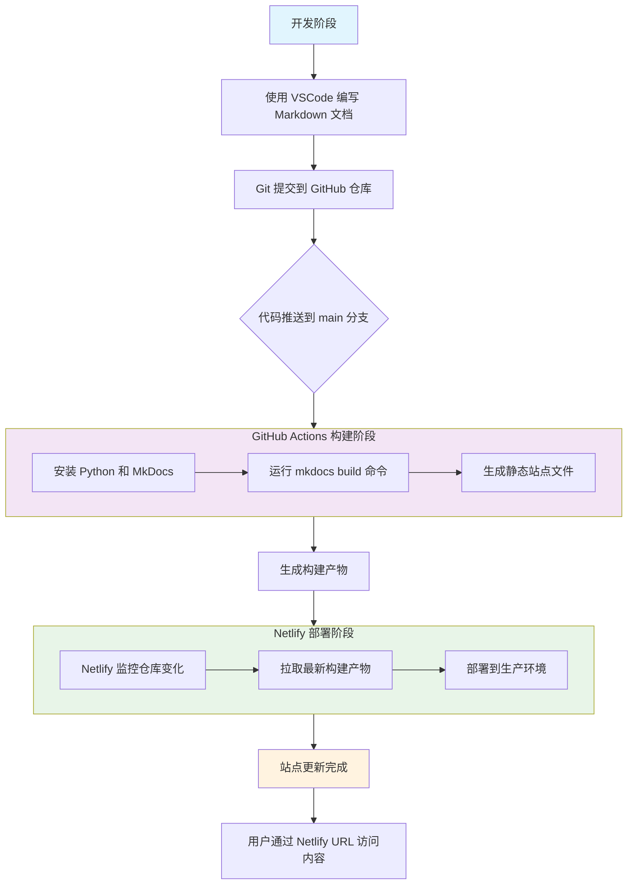

# 流程图

```mermaid
flowchart TD
    A[开发阶段] --> B[使用 VSCode 编写 Markdown 文档]
    B --> C[Git 提交到 GitHub 仓库]
    C --> D{代码推送到 main 分支}
    D --> E[触发 GitHub Actions 工作流]
    
    subgraph E [GitHub Actions 构建阶段]
        E1[安装 Python 和 MkDocs]
        E2[运行 mkdocs build 命令]
        E3[生成静态站点文件]
        E1 --> E2 --> E3
    end

    E --> F[生成构建产物]
    F --> G[Netlify 自动部署]
    
    subgraph G [Netlify 部署阶段]
        G1[Netlify 监控仓库变化]
        G2[拉取最新构建产物]
        G3[部署到生产环境]
        G1 --> G2 --> G3
    end

    G --> H[站点更新完成]
    H --> I[用户通过 Netlify URL 访问内容]

    style A fill:#e1f5fe
    style E fill:#f3e5f5
    style G fill:#e8f5e8
    style H fill:#fff3e0
```
